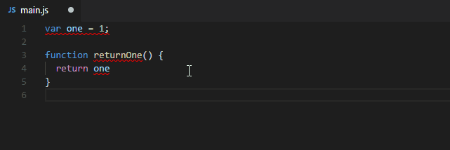

<!--

-->
## Why are Coding Standards Imporant?

There are many reasons why coding standards are important to uphold when writing code, especially when working in a team. Maintaining standards in your code improves readability, making it much easier for teammates to understand exactly what is going on. This is crucial for collaboration because it allows different people to work on a project effectively without spending lots of time merely understanding the code. Maintenance or changing segments of code is also much easier when proper standards are present. Proper spacing can prevent an extra parenthesis or bracket from being forgotten or added by accident, reducing the likelihood of new bugs.

## Learning the Proper Way

I think making an effort to understand coding standards and implementing them in every piece of code you write is a great method to utilize when learn a new programming language. Beginning a large endeavor like that and starting with good habits will be much easier than having to correct poor habits later. Understanding how to correctly space brackets and parenthesis also helps a new programmer to understand exactly how the functions and declarations etc. actually work. I think it helps to visualize code blocks, and easily identifying when a new method or function begins and ends.

## IntelliJ and ESLint

   

Recently, I have made the switch from primarily using Visual Studio Code to using IntelliJ. Overall, I really enjoy using IntelliJ and I think this is partly due to the fact that it is very similar to VSCode. I am still getting used to some of the functionality, but the transition in general has been painless. Previously, when I would write most of my code in Java, I used CheckStyle which is also very simliar to ESLint, at least in some aspects. They are both incredibly strict but also incredibly useful. Tools such as Checkstyle and ESLint are great for ensuring quality code is written, while also catching any silly mistakes along the way. I just began using ESLint, but from what I can tell it is a very intelligent program that not only catches syntax errors, but makes suggestions for consistency and overall code quality.
