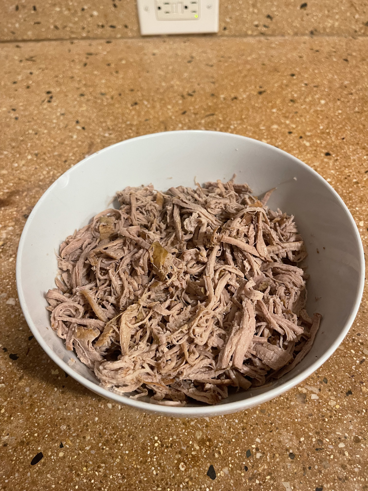
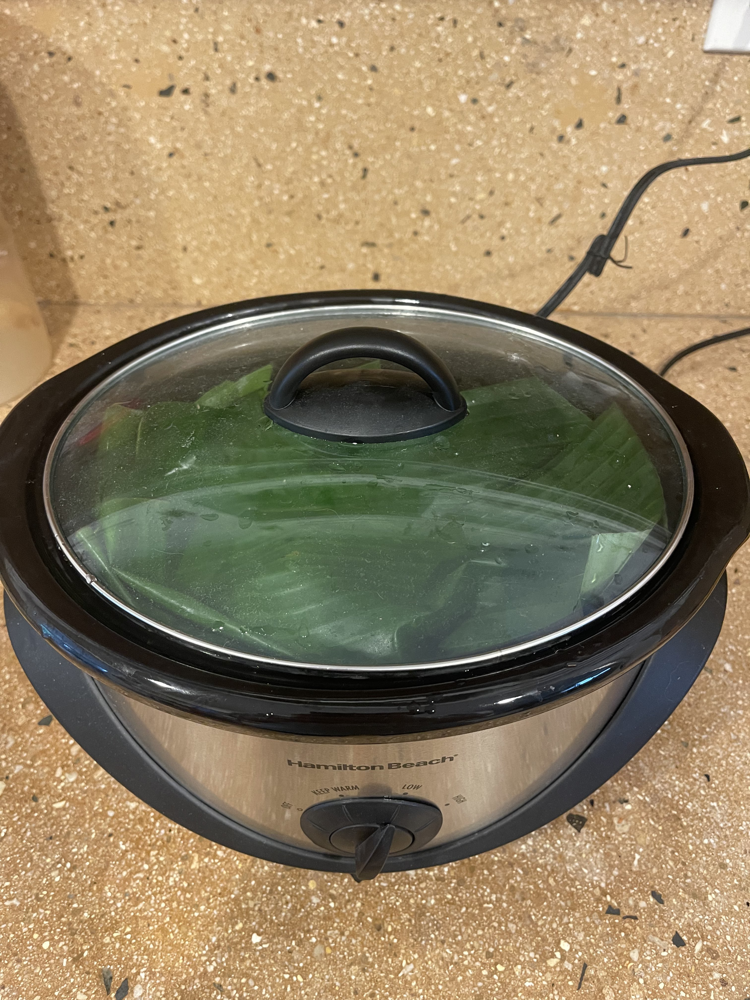
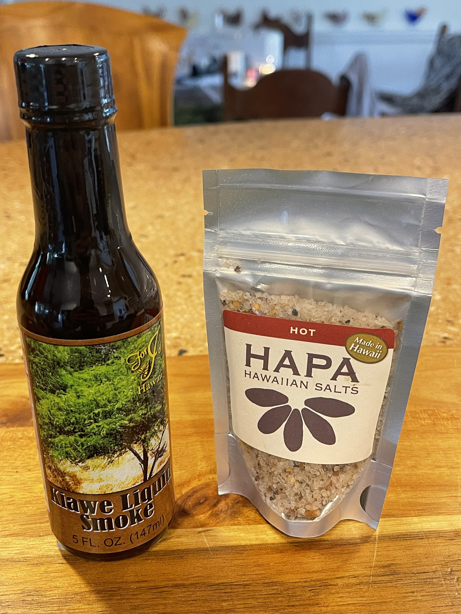

Over the course of a semester, I researched Kalua Pig and it's cultural significance to Hawaii. I learned about it's history, it's symbolism, traditional methods of preparation, modern adaptations, and more. This project took a great deal of time and effort, and I was very happy with my final version. As part of the research process, I made Kalua Pig as authentically as I could, I have included some photos of the cooking process.

  
  
  

Here is the introduction to my essay and if you would like to read the whole thing, please click on the link to my google docs.

  For my decolonial potluck project, I have decided to study Kalua pig and its historical significance in Hawaii. Being born and raised here in Hawaii, Kalua pig has been a dish that I have enjoyed my entire life. Before this project, I understood that pigs have a large cultural significance in the Native Hawaiian culture and its history, although I wanted to research this further. By looking into typical meals and combinations involving Kalua pig, I will research individual ingredients, cooking methods, and compare the Kalua pig of today with that of the pre-contact Hawaiian society. To examine a decolonial view of this meal, I want to find a way to prepare the dish in a way that is authentic as possible to Native Hawaiian culture and avoid any modern ‘colonial’ adaptions. The traditional methods are celebrated frequently by Native Hawaiians today, but I would like to attempt in my own way to make this dish as traditional as possible. The primary questions I want to explore to better understand Kalua pig are: What significance does this dish have in the Native Hawaiian culture? How has this meal been adapted over time from outside influences, and how can Kalua Pig be made in an appropriate way today without erasing the history behind the dish?

[Click Here](https://docs.google.com/document/d/1pX1GIplCi4Lp_656JviqO9fxteP5nL0X/edit?usp=sharing&ouid=111421567883961346202&rtpof=true&sd=true) for the full text.
