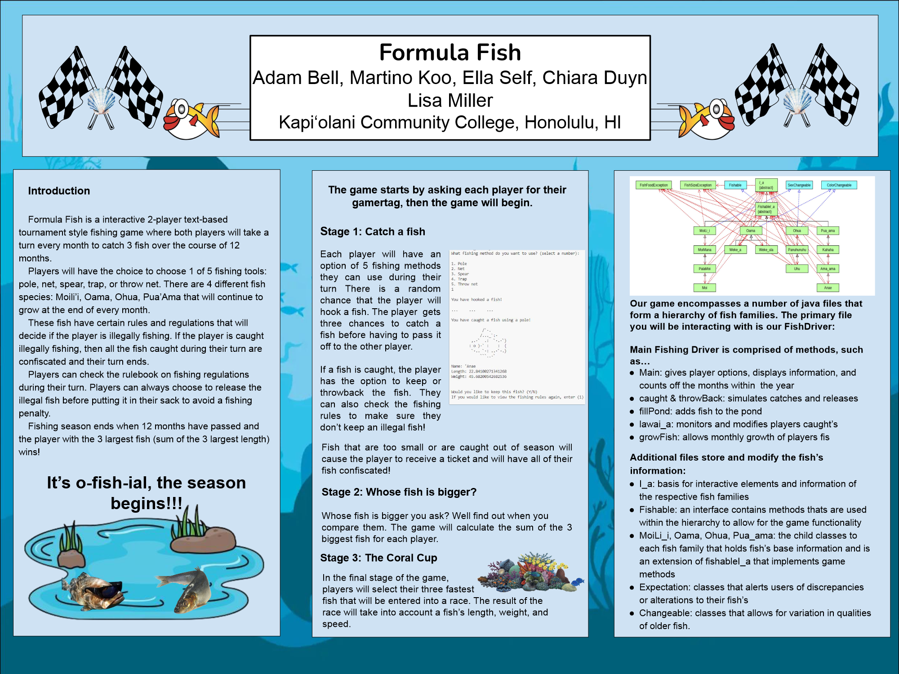

Formula Fish is a simple game played in the console of an IDE. The game is a two-player turn based game where each player is given 12 months to catch as many fish as they can, while following the rules of fishing such as legal fish size, legal months, etc. At the end of the game, players will put forward their 3 fastest fish they have caught, and place them in a series of head-to-head races to determine the winner.

My group and I worked together for a large portion of the semester and finally presented our work at the SURF research fair at Kapiolani Community College. Credit to: Chiara Duyn, Ella Self, and In Mo Koo for working alongside me in this project.
 
Source: [(https://github.com/ICSatKCC/a6-lawa-i-fishing-game-f23-g2_f23_a6/tree/dev-Final)]

