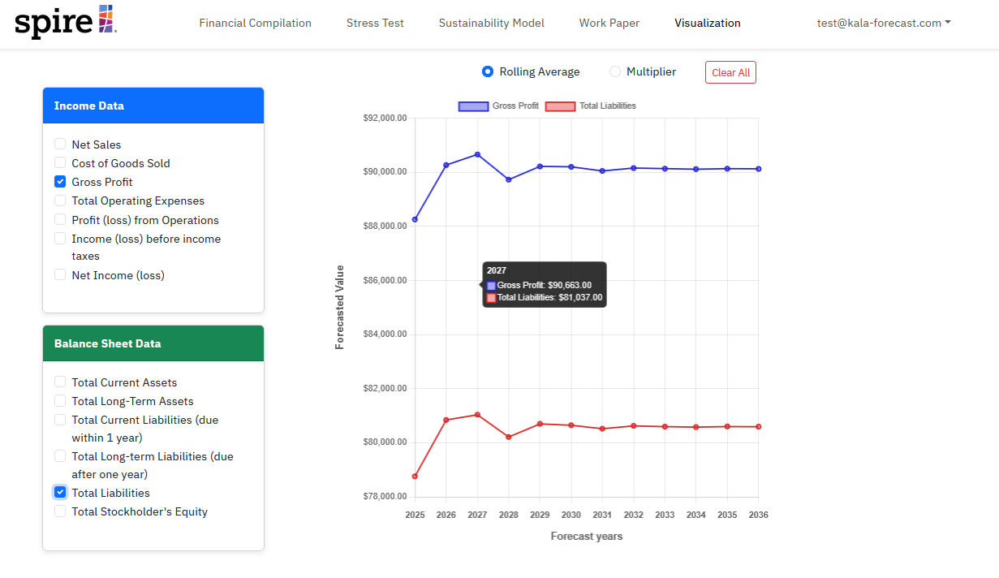
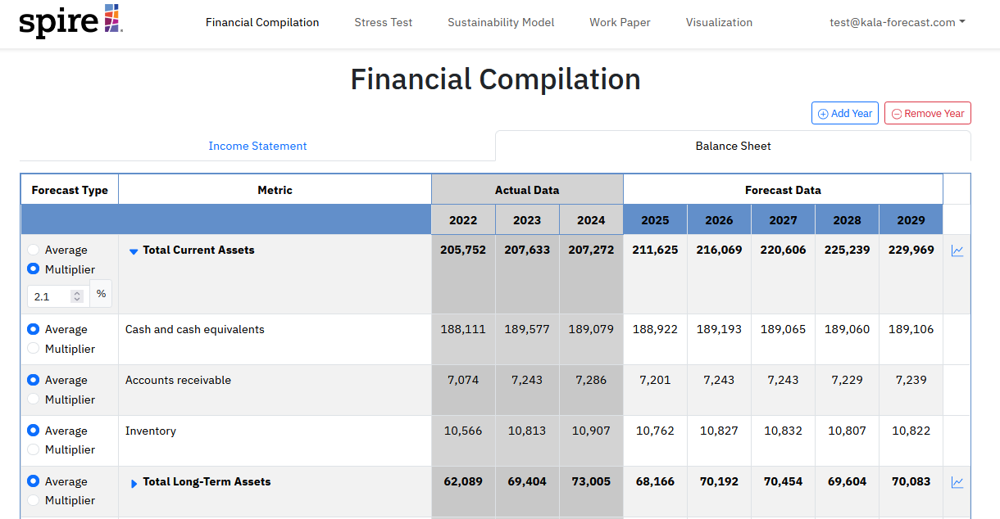

## Overview

Kālā Forecast is a full-stack financial sustainability platform built for Spire Financial — a modern alternative to spreadsheets for teams that need real forecasting infrastructure. The platform integrates fiscal sustainability models, stress testing, financial compilations, and scenario analysis into a unified, role-based dashboard.

## Tech Stack

Built on the **Meteor** framework with **MongoDB** and a **React** front-end, Kālā Forecast delivers a customized experience per user role within the organization.

**Key features:**
- Role-based account management tailored to individual needs within the company
- Stress testing against audited financial data
- Sustainability model views and scenario analysis
- Workpaper creation, editing, and review
- Dynamic forecasting outcome charts and graph views

## Dynamic Forecasting

Interactive charts provide real-time insight into projected financial outcomes — allowing teams to model scenarios directly in the browser.

## Financial Compilations

Structured workpaper and compilation views replace static spreadsheets with editable, database-driven tables — keeping financial data auditable and understandable.

## My Contributions

As one of seven developers, I contributed across multiple milestones using an Issue Driven Project Management workflow. The project was built iteratively — from initial mockups through to full back-end functionality, including database interactions and forecast calculations.

## Takeaways

This project gave me hands-on experience building financial tooling in a collaborative team environment — balancing a polished UI with meaningful back-end logic like database-driven calculations and multi-role access control. Coordinating across seven developers strengthened my ability to manage scope and communicate across parallel workstreams.

The full project GitHub page is available at [kala-forecast.github.io](https://kala-forecast.github.io/).
