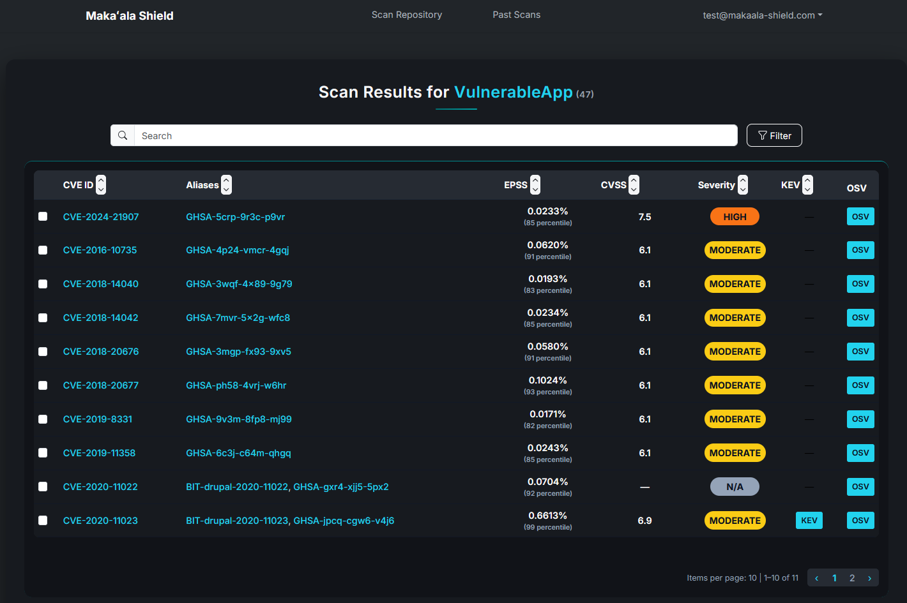

 

## Overview
 
Makaʻala Shield is a modular security analysis platform that automates vulnerability detection across software repositories. Originally scoped for a five-person team, the project was completed by just two developers — requiring us to take on the full backend, database architecture, scanner integration, enrichment pipeline, SBOM generation, and frontend dashboard ourselves.
 
The platform aggregates results from multiple open-source security scanners, normalizes them into a unified format, enriches findings against public vulnerability catalogs, and presents everything through a filterable, sortable web dashboard.
 

## Tech Stack
 
**Backend:** Python with FastAPI  
**Frontend:** React (JavaScript)  
**Database:** PostgreSQL  
**Containerization:** Docker
 
**Scanning Tools:** Trivy, Bandit, Grype
 
**SBOM & Validation:** Syft, CycloneDX-CLI
 
**Vulnerability Enrichment:** OSV, CVSS, KEV, EPSS
 

## Database Architecture
 
A central focus of my work was designing the relational database that ties the platform together. The PostgreSQL schema tracks the full lifecycle of a security scan — from user authentication through to enriched vulnerability results.
 
**Key entities:**
- **Users** – Role-based accounts with scan history and permissions
- **Scans** – Top-level scan records tied to a target repository and user
- **Scanner Results** – Findings per tool normalized into a shared schema for cross-tool comparison
- **Enrichment Results** – Per-vulnerability records linking scanner findings to catalog entries and API queries to combine CVSS scores, KEV status, and EPSS probability results
This schema allowed the dashboard to filter and prioritize vulnerabilities across all scanners in a unified view

 

## My Contributions
 
As Backend & Database Lead on a project designed for five, I owned the FastAPI server, PostgreSQL schema, scanner orchestration, and enrichment pipeline. My partner handled the React frontend while we collaborated closely on the API layer between the two.
 
- Designed the full relational database schema across all entities
- Integrated Trivy, Bandit, and Grype with normalized output ingestion
- Implemented SBOM generation via Syft and CycloneDX-CLI
- Built the enrichment pipeline against OSV, KEV, CVSS, and EPSS
- Developed FastAPI endpoints consumed by the frontend dashboard
- Containerized backend services with Docker

## Takeaways
 
Working at this scope as a two-person team required constant prioritization. LLM-powered explanations and automated CI/CD scan templates were cut to keep the core system — scanners, enrichment, SBOM, and dashboard — fully integrated and functional. Designing a database schema that cleanly represented multiple scanners and enrichment sources was one of the most technically demanding parts of the project, and reinforced how much upstream data modeling shapes everything built on top of it.
 
