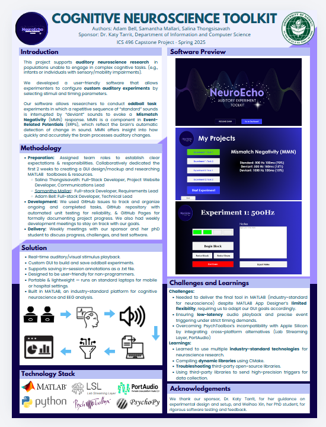

## Overview

NeuroEcho is a cognitive neuroscience toolkit designed for auditory research with populations that cannot actively participate in traditional cognitive tasks — including newborns, young children, and individuals with sensory or mobility impairments.

The platform centers on an **auditory oddball task**, a standard neuroscience paradigm in which a sequence of frequent (standard) tones is periodically interrupted by infrequent (deviant) tones. These deviant sounds elicit a brain response known as **Mismatch Negativity (MMN)** — an Event-Related Potential (ERP) that reflects the brain's automatic detection of auditory change, providing insight into cognitive processing speed and auditory discrimination.

## Tech Stack

**Primary Platform:** MATLAB with App Designer  
**Audio Playback:** PortAudio, Lab Streaming Layer (LSL)  
**Cross-Platform Support:** PsychoPy  
**Build System:** CMake (dynamic library compilation)  
**Version Control & CI:** GitHub, GitHub Actions  

## Key Features

- Custom GUI for designing, configuring, and saving auditory experiments
- Real-time audio/visual stimulus playback with low-latency precision
- In-session annotation support saved as `.txt` files
- Portable and lightweight — runs on standard laptops for mobile or clinical settings
- Designed for non-programmer researchers in hospital and lab environments
- Industry-standard MATLAB platform compatible with EEG acquisition workflows

## My Contributions

As Full-Stack Developer and Technical Lead on a four-person team, I owned the architecture and implementation of the auditory stimuli tool while coordinating development across the team.

- Led full-stack development of the MATLAB App Designer GUI
- Integrated PortAudio and LSL for low-latency, precise event triggering
- Resolved cross-platform incompatibilities between MATLAB and Apple Silicon using PortAudio as an alternative to PsychoPy
- Compiled and integrated dynamic libraries via CMake
- Managed the GitHub repository, issue tracking, and CI pipeline
- Held weekly meetings with our sponsor and PhD student advisor to align on progress and testing

## Challenges & Takeaways

Delivering in MATLAB — the neuroscience industry standard — meant working within App Designer's limited UI flexibility and navigating significant cross-platform constraints. Getting precise, low-latency audio event triggers required troubleshooting third-party open-source libraries and ultimately compiling custom dynamic libraries with CMake, which was one of the more demanding technical problems of the project.

The experience reinforced how much domain context matters when building research tooling — the software had to meet scientific rigor requirements, not just functional ones.

The full project site is available at [neuronicu.github.io](https://neuronicu.github.io/).

The project's poster presented at the University of Hawaii Information & Computer Sciences Fair (2025).

