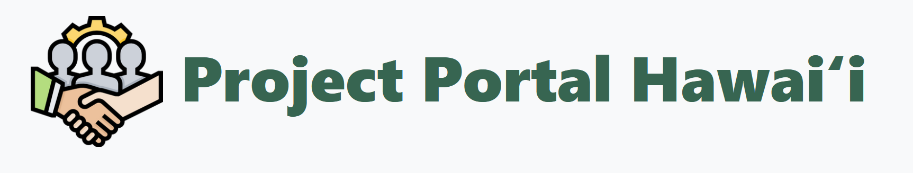

## Overview

Project Portal Hawaii is a full-stack web application built for University of Hawaiʻi students to discover, join, and propose academic projects. Faculty and community sponsors can post opportunities, while students can browse available projects, view completed showcases, and build their professional portfolios.

## My Contributions

Working within a five-person team using Issue Driven Project Management, I contributed across three milestones — from building out the initial HTML structure to implementing data model functionality and refining the user experience. Development followed a structured GitHub Projects workflow, with each task tracked as an issue, developed on its own branch, and reviewed before merging.

## Tech Stack

Built on the [Meteor](https://www.meteor.com/) framework with MongoDB and a React front-end, the application supports full user authentication, profile management, project creation and editing, and a randomized project discovery feature.

**Key features:**
- User authentication with role-based profile management
- Browse and filter available projects
- Propose new projects for the community
- Showcase completed work for future students to reference

## Takeaways

This project gave me hands-on experience with full-stack collaborative development — coordinating across a team, managing merge conflicts, and iterating based on real user feedback gathered through on-campus testing sessions.

A full developer guide and project history are available on the [Project Portal Hawaii GitHub page](https://project-portal-hawaii.github.io).
